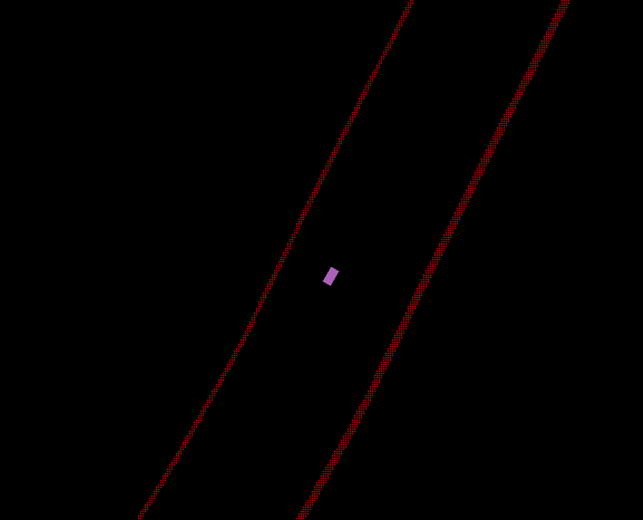
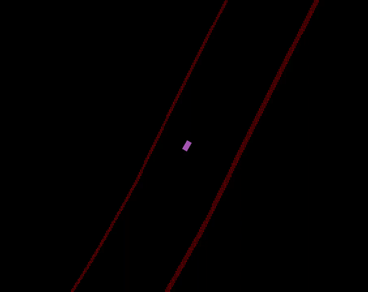
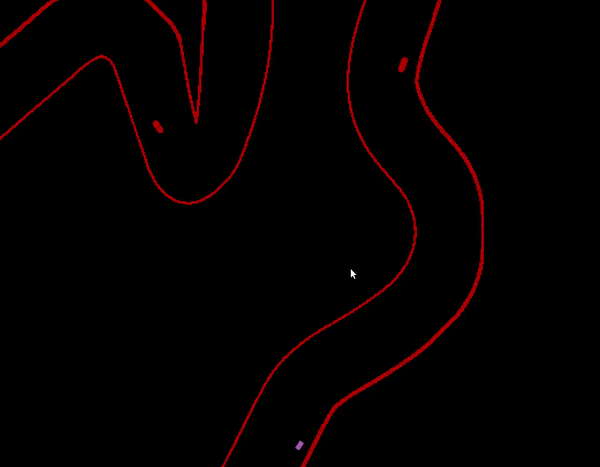

# MEN491_2021
Creating Autonomous vehicle Lecture materials, MEN491 (2021, UNIST)

# Installation 
clone this repository into your workspace and install required packages:

```bash
mkdir -p ~/yourworkspace_name/src
cd ~/yourworkspace_name/src
git clone https://github.com/HMCL-UNIST/MEN491_2021.git
git checkout -b student 
cd ~/yourworkspace_name/src/f1tenth-gym-quickstart
pip install --user -e gym
cd ~/yourworkspace_name
catkin_make
```
Finally, check if the repo is working properly:

```bash
cd pkg/src
python -m pkg.main
```

if you face the "Could not find SDL" error, download the followings
```bash
sudo apt-get install libsdl-image1.2-dev
sudo apt-get install libsdl-dev
```

# Included Packages

## beginner_tutorials
Simple ROS example package for hands-on sesssions

## f1tenth-riders-quickstart 
Autonomous vehicle simulation package

To run the simulation, launch [gym_bridge_rviz.launch](./f1tenth-riders-quickstart/f1tenth_gym_ros/launch/gym_bridge_rviz.launch) file.

```bash
source ~/yourworkspace_name/devel/setup.bash
roslaunch f1tenth_gym_ros gym_bridge_rviz.launch
```

There are two maps, one with obstacle-free and the another has obstacles on the road. 
The maps are saved in [map](./f1tenth-riders-quickstart/f1tenth_gym_ros/maps/)

To change the map, we need to edit environment variables which can be done in [gym_bridge_rviz.launch](./f1tenth-riders-quickstart/f1tenth_gym_ros/launch/gym_bridge_rviz.launch).
To change the map, edit the "RACE_MAP_PATH" value.
To add opponent vehicle in the race, set "1" for "RACE_SCENARIO". 
If you simulate with opponent, you need to implement how they will drive in simulation (like your ego-vehicle).
This can be easily done by just initiate your algorithm for ego-vehicle to the opponent vehicle as well. 

```xml
<?xml version="1.0"?>
<launch>
  <!-- Launch a map from the maps folder-->
  <arg name="map" default="$(find f1tenth_gym_ros)/maps/SILVERSTONE.yaml"/>  
   <env name="RACE_MAP_PATH" value="$(find f1tenth_gym_ros)/maps/SILVERSTONE.yaml"/>
   <env name="RACE_MAP_IMG_EXT" value=".png"/>
   <env name="RACE_SCENARIO" value="0"/>
   <env name="EGO_ID" value="ego"/>
   <env name="OPP_ID" value="opp"/>
      
  <!-- <arg name="map" default="$(env RACE_MAP_PATH)"/> -->
  <node pkg="map_server" name="map_server" type="map_server" args="$(arg map)"/>

  <!-- Launch robot model -->
  <include file="$(find f1tenth_gym_ros)/launch/racecar_model.launch"/>

  <!-- Launch gym bridge node -->
  <rosparam command="load" file="$(find f1tenth_gym_ros)/params.yaml"/>
  <param name="map_path" value="$(arg map)"/>
  <node pkg="f1tenth_gym_ros" name="gym_bridge" type="gym_bridge_bare.py" output="screen" required="true"/>
</launch>

```
Once you launch the above simulation, you will see the image like below, and vehicle is not moving at all. 



To control the vehicle, you need to implement your own algorithms (which you will do it during Practical sessions).
There are two skeleton codes to help you start. 
1. [wall folloing](./f1tenth-riders-quickstart/pkg/nodes/wall_follow_agnet.py)
2. [gap following](./f1tenth-riders-quickstart/pkg/nodes/gap_follow_agent.py)
Once you fill and complete the skeleton codes, you can start to drive by launch [f1tenth_gym_agent.launch](./f1tenth-riders-quickstart/pkg/launch/f1tenth_gym_agent.launch)
**Remember to initiate the simulation first before you initiate the agent launch file. 
```bash
 roslaunch pkg f1tenth_gym_agent.launch
 ```

 From the launch file, you can select which algorithm to run by changing the type of the node. 
 For wall following module 
 ```xml 
 <?xml version="1.0"?>
<launch>     
    <arg name="F1TENTH_AGENT_NAME" value="ego"/>
   <env name="F1TENTH_AGENT_NAME" value="ego"/> 
    <node pkg="pkg" type="wall_follow_agnet.py" name="gym_agent_$(arg F1TENTH_AGENT_NAME)" output="screen"/>
</launch>
 ```
 For gap following module 
 ```xml 
 <?xml version="1.0"?>
<launch>     
    <arg name="F1TENTH_AGENT_NAME" value="ego"/>
   <env name="F1TENTH_AGENT_NAME" value="ego"/> 
    <node pkg="pkg" type="gap_follow_agent.py" name="gym_agent_$(arg F1TENTH_AGENT_NAME)" output="screen"/>
</launch>
 ```

## Autonomous driving in simulation demo videos 
### wall following

### gap following in map with obstacles 



